<p align='center'>
	
</p>

<h3 align="center">Chat.io</h3>
<p align="center">Real-time Messenger Web Application</p>

### Abstract

A full-stack web application which supports many useful real-time features including:
text messaging, video/voice calling, notifications, and many more.

### Core Technologies


### Instructions

1. Create a workspace folder.
    ```sh
    mkdir chat-io
    cd chat-io
    ```
2. Clone the front-end repo (this repo) and back-end repo.
    ```sh
    git clone https://github.com/danielphan-dp/chat-io
    git clone https://github.com/danielphan-dp/chat-io-be
    ```

3. Navigate to the front-end repo. Install Node modules for the front-end.
    ```sh
    cd <path-to-front-end-repo>
    npm install
    ```
4. Navigate to the back-end repo. Install Node modules for the back-end.
    ```sh
    cd <path-to-back-end-repo>
    npm install
    ```
5. Run the back-end, then the front-end in 2 separate Terminal windows. At the moment, it's optimal to
run the processes in 2 separate Terminal windows.
    ```sh
    # inside back-end repo and the associated Terminal window
    npm start
    ```
    ```sh
    # inside front-end repo and the associated Terminal window
    npm start
    ```


The application should be available in [localhost:3000](localhost:3000).

## Usage

### Sign Up
Enter your e-mail, username and chosen password (ideally a strong password).
<p align="center">
  
</p>

The submit button should be available immediately after valid input is entered.

<p align="center">
  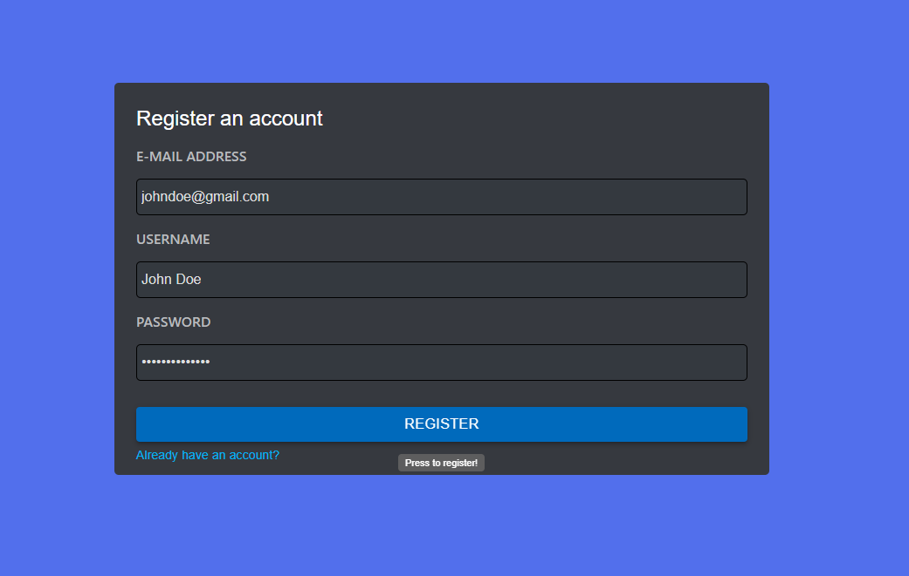
</p>

You are all set at this point!

### Sign In

Enter your registered credentials, and you will be automatically redirected to the dashboard page.

<p align="center">
  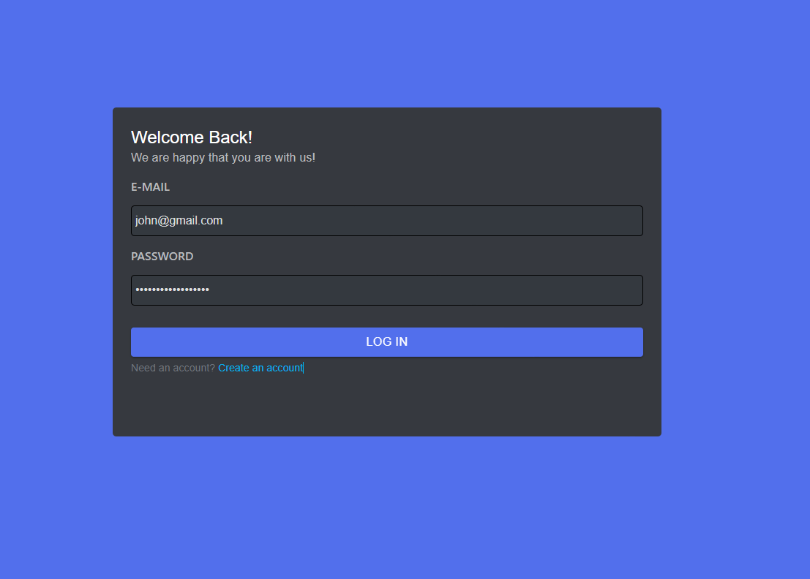
</p>

<p align="center">
  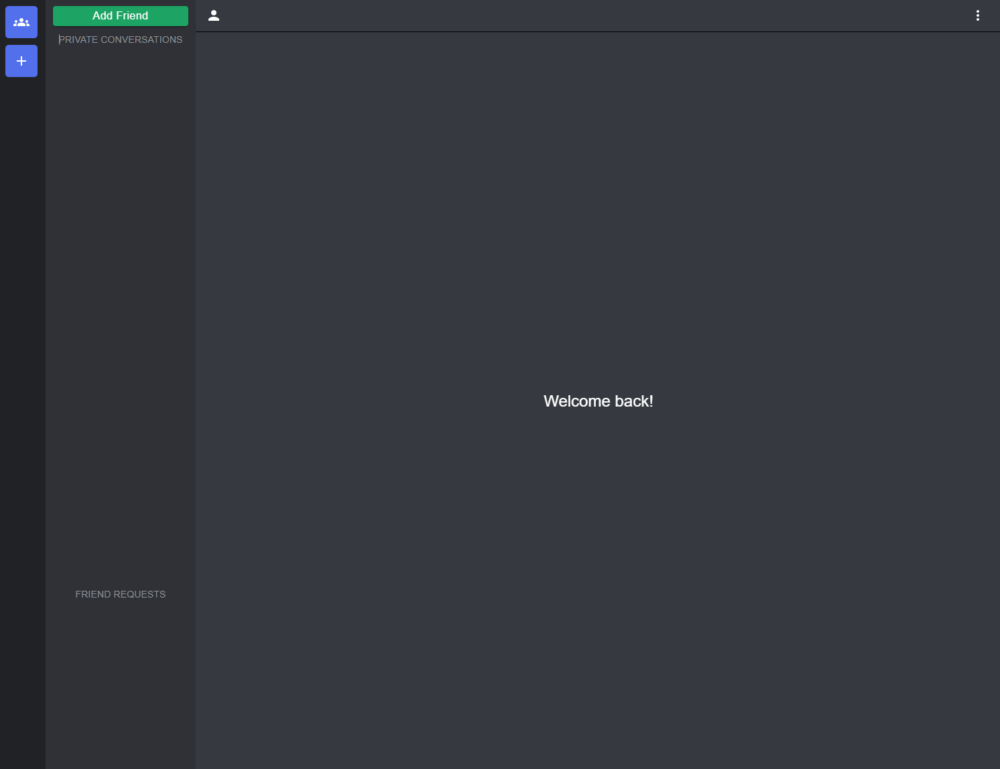
</p>

The server will provide promt when invalid credentials are entered.

<p align="center">
  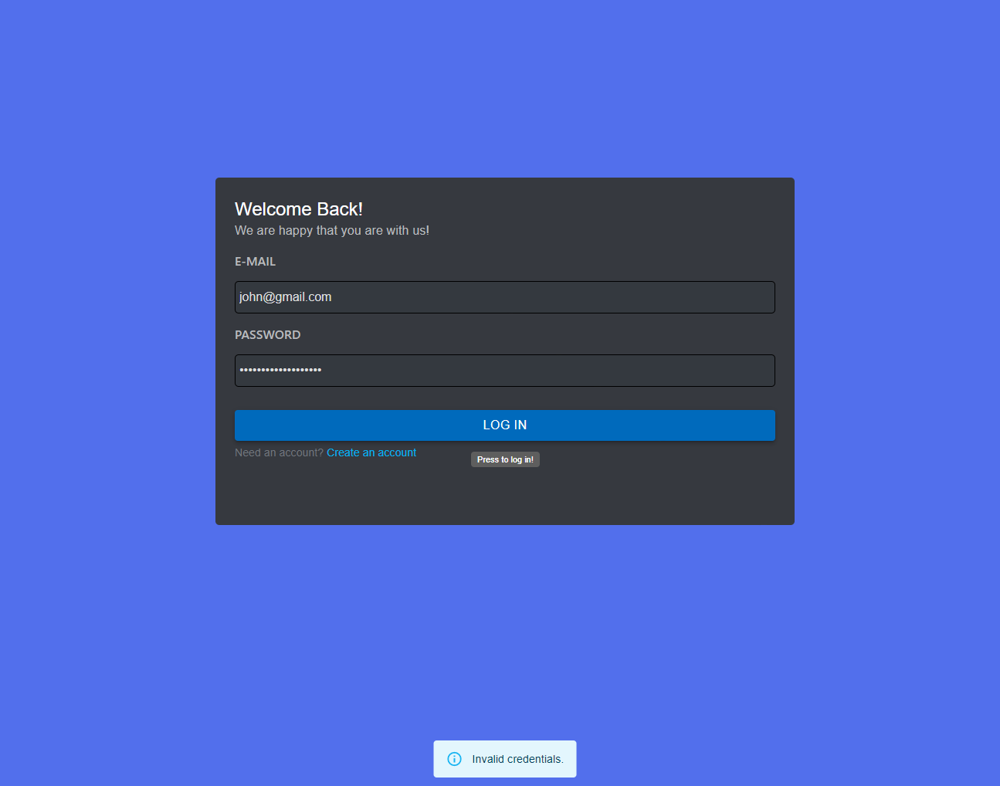
</p>

<p align="center">
  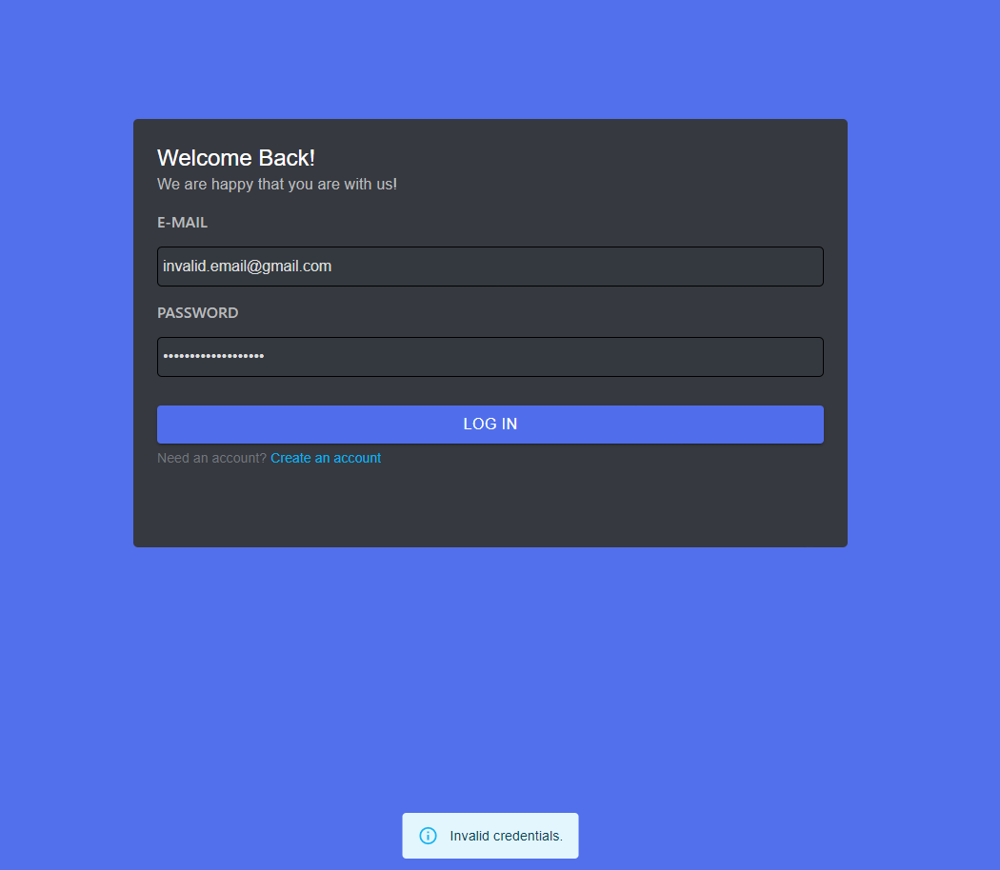
</p>

### Dashboard UI
<p align="center">
  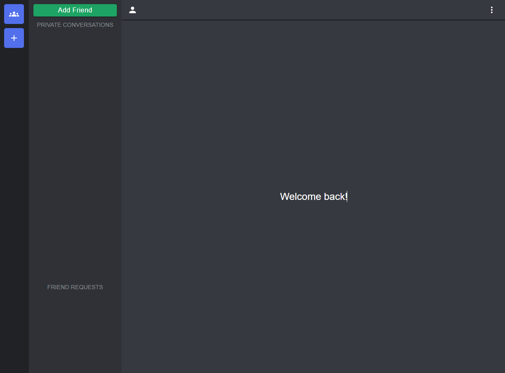
</p>

### Send Friend Request
<p align="center">
  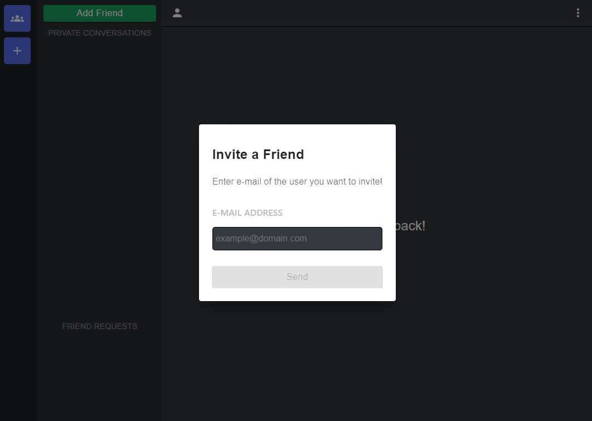
</p>

<p align="center">
  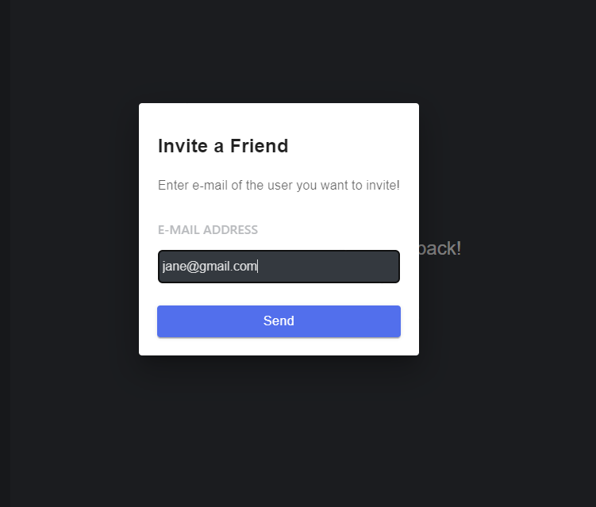
</p>

Your friend request will be updated in real-time to the other user!

<p align="center">
  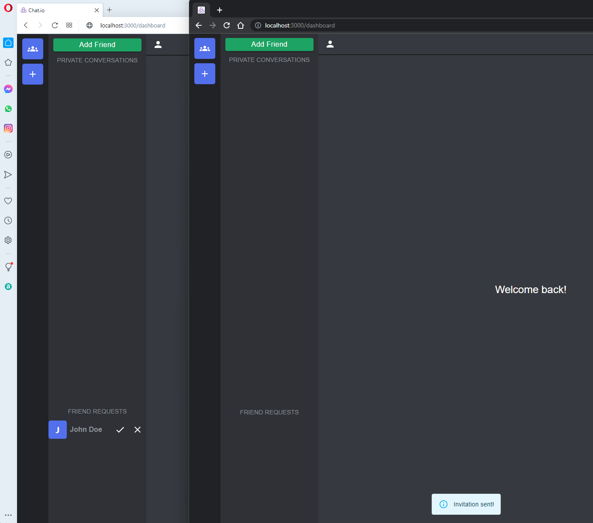
</p>

### Accept Friend Request

<p align="center">
  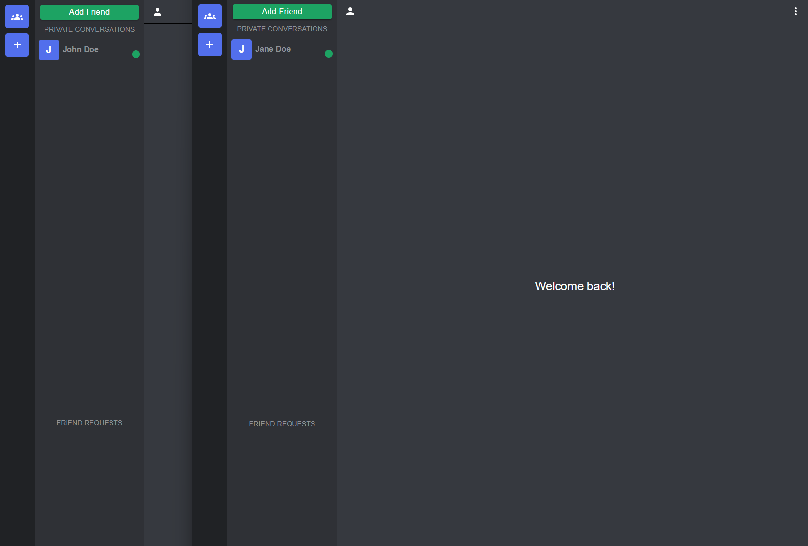
</p>

### Text Message

<p align="center">
  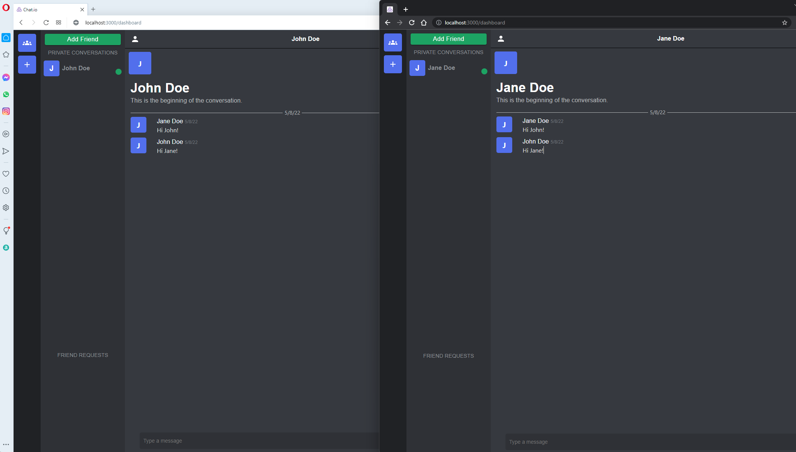
</p>

### Video Calling

### Video Call Rooms

### Screen sharing


### Features

- [x] Real-time text messaging, video calling, and updates
- [x] Friends invitation system
- [x] User ability to control different video and audio sources
- [x] Compatible with screen sharing
- [x] User sign up and sign in system
- [x] Server-side and client-side invalid form information inputs handling
- [x] Compatible with multiple browsers (Chrome, Edge, Firefox, and Opera)
- [ ] GUI Themes and Modes (Dark, Light, Solarized, etc.)
- [ ] Chat Message Cells of Different Content Types
  - [ ] Markdown and LaTeX Cells
  - [ ] Code Cells (with Syntax Highlighting)

