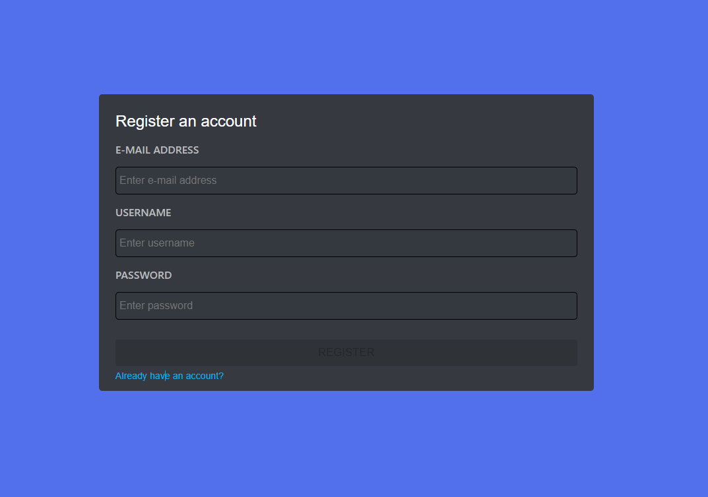

<p align='center'>
	
</p>

<h3 align="center">
	Chat.io
</h3>

<p align="center">
	A web application to help you stay connected.
</p>
<p align="center">In real-time!</p>

## About The Project

A full-stack web application that support many useful real-time features including:
text messaging, video/voice calling, notifications, and many more.
Available in your local machine in just a few simple set-up steps.

### Core Technologies

- 

- 

- 

- 

- 

- 

- 

- 

- 

## Getting Started

### Workspace Set-up

- Create a new folder in local machine. This will be the root folder storing both the front-end and back-end of the project (which are maintained in separate repos).

  ```sh
  mkdir <WORKSPACE-NAME>
  ```

- Clone the front-end repository. The front-end repository is this repo.

  ```sh
  git clone <FRONT-END-REPOSITORY-LINK>
  ```

- Clone the back-end repository. To access the back-end repository, click [here](https://github.com/danielphan-dp/messanging-platform-server).

  ```sh
  git clone <BACK-END-REPOSITORY-LINK>
  ```

### Installation

- From the workspace folder, go to the front-end directory and install necessary packages.

  ```sh
  cd <FOLDER-OF-FRONT-END-REPO>
  npm install
  ```

- From the workspace folder, go to the back-end directory and install necessary packages.

  ```sh
  cd <FOLDER-OF-BACK-END-REPO>
  npm install
  ```

### Run

To test the features, it is the best to run the front-end and the back-end in two separate terminals.

- Start a new terminal window, go to the back-end folder, and run the server.

  ```sh
  cd <FOLDER-OF-BACK-END-REPO>
  npm start
  ```

- Start a new terminal window, go the to the front-end folder, and run the front-end dev server.

  ```sh
  cd <FOLDER-OF-FRONT-END-REPO>
  npm start
  ```

- The application should be available in `localhost:3000`.

## Usage

### Sign Up
Enter your e-mail, username and chosen password (ideally a strong password).
<p align="center">
  
</p>

The submit button should be available immediately after valid input is entered.

<p align="center">
  
</p>

You are all set at this point!

### Sign In

Enter your registered credentials, and you will be automatically redirected to the dashboard page.

<p align="center">
  
</p>

<p align="center">
  
</p>

The server will provide promt when invalid credentials are entered.

<p align="center">
  
</p>

<p align="center">
  
</p>

### Dashboard UI
<p align="center">
  
</p>

### Send Friend Request
<p align="center">
  
</p>

<p align="center">
  
</p>

Your friend request will be updated in real-time to the other user!

<p align="center">
  
</p>

### Accept Friend Request

<p align="center">
  
</p>

### Text Message

<p align="center">
  
</p>

### Video Calling

### Video Call Rooms

### Screen sharing


## Features

- [x] Real-time text messaging, video calling, and updates
- [x] Friends invitation system
- [x] User ability to control different video and audio sources
- [x] Compatible with screen sharing
- [x] User sign up and sign in system
- [x] Server-side and client-side invalid form information inputs handling
- [x] Compatible with multiple browsers (Chrome, Edge, Firefox, and Opera)

### Planned Features

- [ ] GUI Themes and Modes (Dark, Light, Solarized, etc.)
- [ ] Chat Message Cells of Different Content Types
  - [ ] Markdown and LaTeX Cells
  - [ ] Code Cells (with Syntax Highlighting)

## Contributing

Contributions are what make the open source community such an amazing place to learn, inspire, and create. Any contributions you make are **greatly appreciated**.

If you have a suggestion that would make this better, please fork the repo and create a pull request. You can also simply open an issue with the tag "enhancement".

1. Fork the Project

2. Create your Feature Branch

   ```sh
   git checkout -b feature/<YOUR-AMAZING-PROPOSED-FEATURE>
   ```

3. Commit your Changes

   ```sh
   git commit -m <YOUR-COMMIT-MESSAGE>
   ```

4. Push to the Branch

   ```sh
   git commit -m 'git push origin feature/<YOUR-AMAZING-PROPOSED-FEATURE>'
   ```

5. Open a Pull Request

## Acknowledgments

In Progress... Check back soon!
